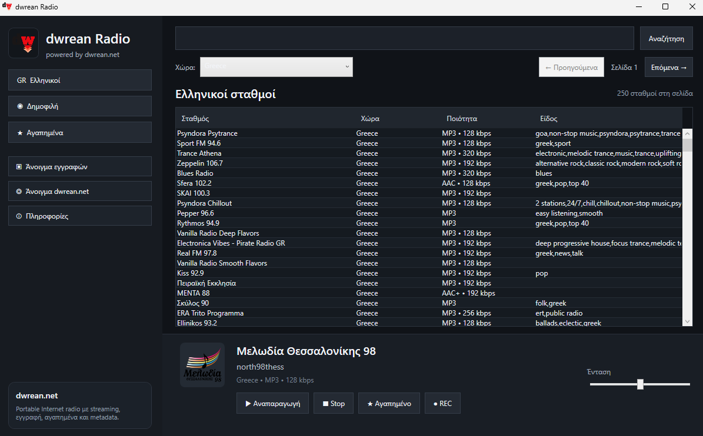

  

<h1 align="center">dwrean Radio</h1>

  Δωρεάν portable διαδικτυακό ραδιόφωνο για Windows

Δωρεάν και portable εφαρμογή διαδικτυακού ραδιοφώνου για Windows από το [dwrean.net](https://www.dwrean.net/).

## Εικόνα της εφαρμογής

## Τι είναι το dwrean Radio;

Το **dwrean Radio** είναι μια δωρεάν εφαρμογή για Windows που σου επιτρέπει να ακούς διαδικτυακούς ραδιοφωνικούς σταθμούς εύκολα, χωρίς εγκατάσταση.

Η εφαρμογή είναι portable, επομένως αρκεί να την αποσυμπιέσεις και να την εκτελέσεις.

## Χαρακτηριστικά

- Διαδικτυακοί ραδιοφωνικοί σταθμοί
- Αναζήτηση σταθμών
- Επιλογή χώρας
- Portable λειτουργία χωρίς εγκατάσταση
- Υποστήριξη Windows 64-bit
- Δωρεάν χρήση

## ⬇️ Λήψη

### [Κατέβασε την τελευταία έκδοση του dwrean Radio](https://github.com/dwrean-net/dwrean-radio/releases/latest/download/dwrean-radio-portable-win-x64.zip)

Δεν απαιτείται εγκατάσταση.

Αποσυμπίεσε το ZIP και εκτέλεσε:

`dwrean.Radio.exe`

## Τρέχουσα έκδοση

**dwrean Radio v0.2.2**

Δες όλες τις διαθέσιμες εκδόσεις στη σελίδα [Releases](https://github.com/dwrean-net/dwrean-radio/releases).

## Απαιτήσεις

- Windows 10 ή Windows 11
- Windows 64-bit
- Σύνδεση στο Internet

## Σχετικά

Το dwrean Radio δημιουργήθηκε για το **dwrean.net**.

🌐 [dwrean.net](https://www.dwrean.net/)

---

**dwrean Radio — Δωρεάν διαδικτυακό ραδιόφωνο για Windows**
